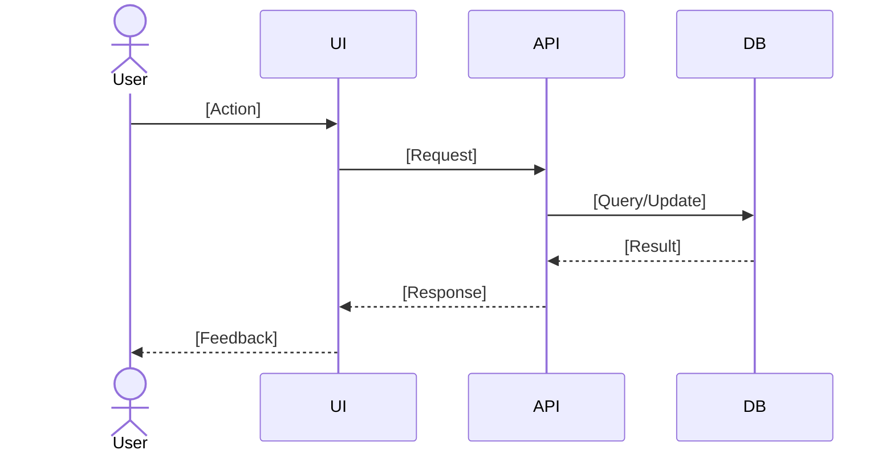

# Reverse Engineering Analysis: [Module Name]

**Document Version:**
**Date:**
**Module:**
**Status:**

---

# 1. EXECUTIVE SUMMARY

## 1.1 Business Purpose

[Describe what this module does in business terms.]

## 1.2 Users

- [User role]
- [User role]

## 1.3 Business Process Supported

[Describe the business process this module supports.]

## 1.4 Impact

- [Operational impact]
- [Compliance impact]
- [Financial impact]

## 1.5 Overall Health Rating

[stable / fragile / high-risk — explain why.]

---

# 2. SYSTEM CONTEXT ANALYSIS

## 2.1 Internal Components

[List UI components, business logic, APIs, stored procedures, files.]

## 2.2 Upstream Dependencies

[List upstream systems or processes that feed data into this module.]

## 2.3 Downstream Components

[List downstream systems or processes that receive output from this module.]

## 2.4 External Integrations

- [External system or service]

## 2.5 Data Storage Components

[List databases, tables, file stores, caches.]

## 2.6 User Roles Interacting

- [Role]
- [Role]

## 2.7 Scheduled/Batch Processes

- [Scheduled job or batch process]

## 2.8 Context Diagram (Text-Based)

```
[ASCII or text-based context diagram]
```

## 2.9 Dependency Risk Assessment

[Describe coupling risks, risks of change, and risks of unavailability.]

---

# 3. COMPONENT INVENTORY AND ANALYSIS

## 3.1 UI Layer Analysis

### 3.1.1 Component Details

[Type, responsibility, complexity, dependencies, health assessment.]

### 3.1.2 UI Controls Inventory

[List inputs, outputs, controls, and events.]

### 3.1.3 Conditional Visibility Logic

[Document controls that show/hide based on field values or state.]

### 3.1.4 Default Values

[List explicit and implicit default values per field.]

### 3.1.5 Prefill Behavior

- [Field prefilled from source]
- [Field prefilled from source]

### 3.1.6 Validation Locations

[UI-level / API-level / DB-level — describe what is validated where.]

### 3.1.7 Error Display Behavior

- [Error scenario and display behavior]
- [Error scenario and display behavior]

### 3.1.8 Technical Debt Assessment

- [Debt item]
- [Debt item]

## 3.2 Business Logic Analysis

### 3.2.1 Key Functions

[List key functions and their business responsibility.]

### 3.2.2 Data Transformations

- [Transformation description]
- [Transformation description]

### 3.2.3 State Change Logic

- [State change trigger and outcome]
- [State change trigger and outcome]

### 3.2.4 Workflow Routing Logic

[Describe how the workflow routes between states or actors.]

1. [Step]
1. [Step]
1. [Step]

### 3.2.5 Authorization Checks

[Describe authorization enforcement points and gaps.]

### 3.2.6 Hardcoded Values

[List hardcoded values and their location.]

### 3.2.7 Redundant or Inconsistent Logic

- [Redundancy or inconsistency and location]
- [Redundancy or inconsistency and location]

## 3.3 Data Access Analysis

### 3.3.1 Stored Procedures / Queries Called

[List stored procedures, ORM queries, or raw SQL patterns.]

### 3.3.2 Transaction Behavior

- [Transaction scope and behavior]
- [Rollback behavior]

### 3.3.3 Performance Concerns

- [Performance risk item]
- [Performance risk item]

### 3.3.4 Schema Coupling

[Describe schema dependencies that create coupling risk.]

## 3.4 Integration Analysis

### 3.4.1 External Services

- [Service name and purpose]

### 3.4.2 Related Integration Module

[Describe any closely related integration service, its role, inputs, outputs, and failure behavior.]

### 3.4.3 Notifications

- [Notification trigger and recipient]
- [Notification trigger and recipient]

### 3.4.4 Error Handling and Resilience

- [Error handling behavior]
- [Retry or fallback behavior]

---

# 4. DATA MODEL ANALYSIS

## 4.1 Data Read Inventory

[List entities/tables read, fields used, and the purpose of each read.]

## 4.2 Data Write Inventory

[List entities/tables written to, fields modified, and conditions for writes.]

## 4.3 End-to-End Data Flow

[Trace: input -> validation -> transformation -> status change -> persistence -> audit/logging.]

## 4.4 Relationship Analysis

[Describe key entity relationships relevant to this module.]

## 4.5 Data Quality & Integrity

### 4.5.1 Schema-Enforced

[Constraints enforced at the database level.]

### 4.5.2 Code-Enforced Only

[Constraints enforced only in application code — fragile if bypassed.]

### 4.5.3 Integrity Gaps

[Known gaps, mismatches, or risks to data integrity.]

---

# 5. BUSINESS RULES ANALYSIS

## 5.1 Inputs & Field Rules

| Field Name | Field Type | Category | Dropdown Values | Default / Prepopulated Value | Dynamic / Calculated | Validation Logic | Mandatory / Optional | Notes |
|---|---|---|---|---|---|---|---|---|
| [Field] | [Input / Read-Only / Prepopulated / Calculated] | [Category] | [Values or N/A] | [Default or N/A] | [Yes / No] | [Validation rule] | [Mandatory / Optional] | [User story notes] |

## 5.2 Business Rules Inventory

| Rule ID | Description | Code Location | Rule Type | Confidence | Documented Elsewhere |
|---|---|---|---|---|---|
| BR-001 | [Rule description] | [File / SP / config] | [Validation / Routing / Auth / SLA] | [High / Medium / Low] | [Yes / No / Partial] |

## 5.3 Calculations

- [Calculation description and location]

## 5.4 Validations

[List validation rules with messages: missing required, invalid value, invalid date, invalid document type/size.]

## 5.5 State Machine / Workflow

### State Transitions

[Describe states and valid transitions.]

### Transition Triggers

[Describe what triggers each transition.]

## 5.6 Work Queue / Assignment

- [Assignment rule or queue behavior]
- [Priority or routing logic]

## 5.7 Authorization

- [Role/permission rule]
- [Enforcement location]
- [Known gap or bypass risk]

## 5.8 SLA / Timer Behavior

- [SLA rule and trigger]
- [Timer escalation behavior]

---

# 6. PROCESS FLOW ANALYSIS

## 6.1 Primary Flow (Happy Path)

1. [Step]
1. [Step]
1. [Step]

## 6.2 Alternate Flows

### AF-1: [Alternate Flow Name]

[Describe conditions and steps for this alternate flow.]

### AF-2: [Alternate Flow Name]

[Describe conditions and steps for this alternate flow.]

## 6.3 Error/Exception Handling

[Describe how errors and exceptions are handled at each flow step.]

## 6.4 Sequence Diagram (Mermaid)



## 6.5 Process Gaps & Pain Points

[Describe missing steps, ambiguities, or known pain points in the flow.]

---

# 7. ERROR HANDLING AND RESILIENCE

## 7.1 Error Handling Patterns

[Describe how errors are caught, surfaced, or swallowed.]

## 7.2 Logging

**Logged:**
- [What is logged and where]

**Not Logged:**
- [What is missing from logs]
- [Risk of missing audit trail]

## 7.3 Recovery Mechanisms

- [Recovery behavior on failure]
- [Manual intervention required?]

## 7.4 Audit Trail Completeness

- [What actions are audited]
- [What actions are not audited]
- [Risk of missing audit records]

---

# 8. PERFORMANCE & SCALABILITY

## 8.1 Query Inefficiencies

- [Query or pattern and risk]
- [Missing index or full-table scan]

## 8.2 Large Payloads

- [Payload concern and context]

## 8.3 Missing Indexes

- [Table and column(s) lacking indexes]

## 8.4 Synchronous Blocking

- [Synchronous call that could block]
- [Impact on throughput]

## 8.5 Memory

- [Memory-heavy operation and context]

---

# 9. SECURITY & COMPLIANCE

## 9.1 Role/Permission Enforcement

- [Permission check and enforcement location]
- [Known gaps]

## 9.2 Gaps or Bypass Vectors

- [Bypass risk and scenario]
- [Missing enforcement point]

## 9.3 Sensitive Data Handling

- [Sensitive field and how it is handled]
- [PII or regulated data risk]

## 9.4 Audit Trail and Integrity

- [What is audited]
- [What is missing]

---

# 10. TECHNICAL DEBT & RISK

## 10.1 Technical Debt Inventory

[List debt items with description, location, and severity.]

## 10.2 Fragility Map

[Identify components most likely to break under change.]

## 10.3 Tribal Knowledge

- [Behavior known only informally — not documented]
- [Risk if key person leaves]

## 10.4 Undocumented Behaviors

- [Behavior with no specification or documentation]
- [Where it was observed]

---

# 11. MIGRATION IMPACT ANALYSIS

## 11.1 Migration Complexity

[Rate and describe complexity: low / medium / high / very high.]

- [Complexity factor]
- [Risk or constraint]

## 11.2 State/Status Mapping Considerations

- [Legacy state -> target state mapping or gap]
- [Unmappable or ambiguous state]

## 11.3 Data Migration Considerations

- [Data requiring transformation or cleansing]
- [Schema change risk]

## 11.4 Integration Migration Considerations

- [Integration requiring re-implementation]
- [Contract or protocol change]

## 11.5 Migration Risk Register

| Risk ID | Description | Likelihood | Impact | Mitigation |
|---|---|---|---|---|
| MR-001 | [Risk description] | [High / Med / Low] | [High / Med / Low] | [Mitigation action] |

## 11.6 Ordering Dependencies

1. [Pre-requisite step]
1. [Ordered migration step]
1. [Post-migration verification]

---

# 12. UNKNOWNS & QUESTIONS

## 12.1 Blockers for Planning

[Questions that must be answered before planning can proceed.]

## 12.2 Blockers for Development

[Questions that must be answered before development can begin.]

## 12.3 Blockers for Testing

[Questions that must be answered before testing can begin.]

---

# 13. APPENDICES

## 13.1 File Inventory

[List all relevant source files analyzed.]

## 13.2 Stored Procedures

[List all stored procedures referenced by this module.]

## 13.3 Database Tables

[List all database tables read or written by this module.]

## 13.4 Status Codes / Lookup Values

[List status codes, enum values, or lookup table values used by this module.]

## 13.5 Glossary

[Define domain terms and abbreviations used in this document.]
